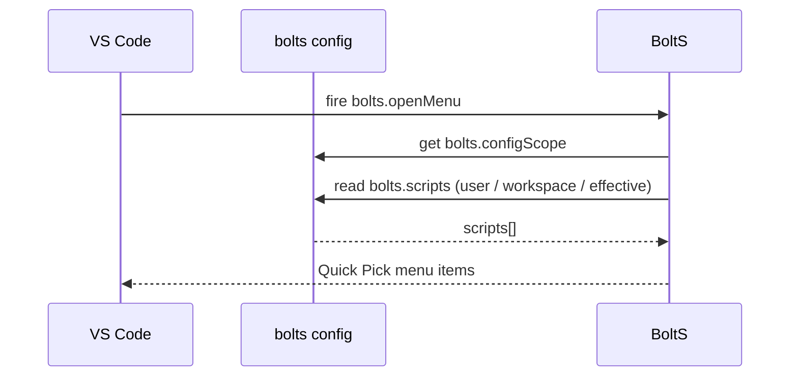
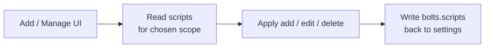
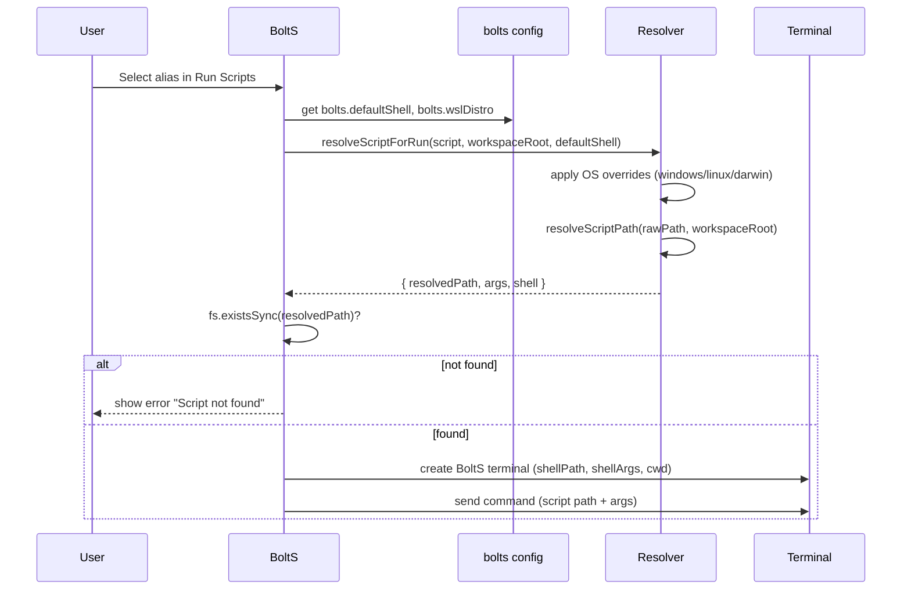

# BoltS Data Flow

This document focuses on how data moves through BoltS when scripts are listed, added, edited, and executed.

---

## 1. Configuration and script list



- **Source of truth**: `bolts.scripts` in VS Code settings.
- **Scope selection**: Controlled by `bolts.configScope` (`effective`, `user`, `workspace`).
- **Validation**: Only entries with a string `alias` and `path` are used.

When adding or editing scripts:



---

## 2. Script execution path



Key details:

- **Path resolution**
  - `./` → relative to the first workspace folder (or home if none).
  - `~/` → relative to the current user’s home directory.
  - Absolute paths (`/…`, `C:\…`) are used as-is.
- **Per-OS overrides**
  - If present, `windows` / `linux` / `darwin` blocks can override `path`, `args`, and `shell`.
- **Shell selection**
  - Per-script `shell` (if set) wins over `bolts.defaultShell`.
  - `bolts.defaultShell = os` falls back to PowerShell on Windows and bash on Linux/macOS.

---

## 3. WSL-specific behavior (Windows)

When a script uses the `wsl` shell:

```mermaid
flowchart LR
  R[Resolved Windows path] --> Conv[Convert to WSL path]
  Conv --> Term[WSL terminal\n(wsl.exe, optional distro)]
  Term --> Run[cd script dir\n+ run script]
```

- The script path and working directory are converted from Windows style to WSL style.
- `bolts.wslDistro` (if set) controls which distro `wsl.exe` launches.

