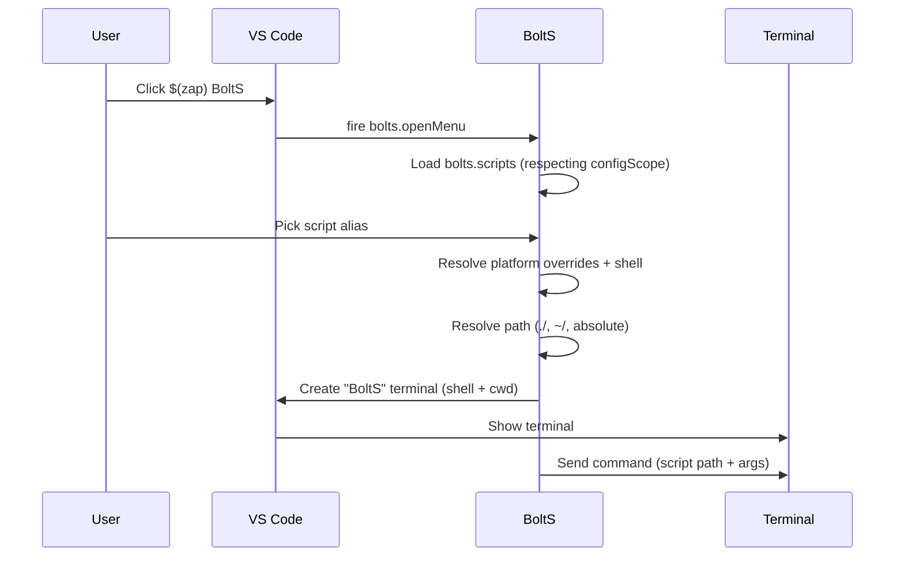

# BoltS: Overview

BoltS is a VS Code / Cursor extension that pins a script launcher to the status bar so you can run shell scripts by alias in a dedicated **BoltS** terminal.

---

## Core ideas

- **Script aliases**: Friendly names mapped to real script paths.
- **Flexible paths**: `./` (workspace-relative), `~/` (home-relative), or absolute filesystem paths.
- **Per-OS behavior**: Optional overrides for Windows, Linux, and macOS.
- **Terminal-first execution**: Scripts always run in an integrated terminal so output is visible and interactive.

---

## User-facing flow

```mermaid
flowchart LR
  U[User] -->|click $(zap) BoltS| SB[Status bar item]
  SB -->|command bolts.openMenu| Menu[Main menu]
  Menu -->|Run script| Run[bolts.runScripts]
  Menu -->|Add script| Add[bolts.addScript]
  Menu -->|Manage scripts| Manage[bolts.manageScripts]
```

1. User clicks **BoltS** in the status bar.
2. A small menu appears: **Run script**, **Add script**, **Manage scripts**.
3. **Run script** opens a Quick Pick of configured aliases.
4. The chosen script runs in a new `BoltS` terminal.

---

## Configuration model

Settings live under the `bolts` namespace:

- **`bolts.scripts`** – Array of script entries:
  - **alias**: Display name shown in the menu.
  - **path**: Script path (`./`, `~/`, or absolute).
  - **args?**: Optional argument string passed as-is to the script.
  - **shell?**: Optional shell for this script (`os`, `powershell`, `cmd`, `bash`, `gitbash`, `wsl`, `sh`).

- **`bolts.configScope`** – Where scripts are read from:
  - `effective` (default): Workspace overrides user settings.
  - `user`: Only global (user) settings.
  - `workspace`: Only this project’s settings.

- **`bolts.defaultShell`** – Fallback shell when a script does not specify one.
- **`bolts.wslDistro`** (Windows) – Optional WSL distro name when using the `wsl` shell.

---

## Execution lifecycle



If the resolved path does not exist, BoltS shows an error instead of starting the terminal.

---

## Where to go next

- **Using BoltS** – See the root `README` for installation and basic usage.
- **Developing BoltS** – See `docs/ARCHITECTURE.md` and `docs/DATA-FLOW.md` for deeper details.
